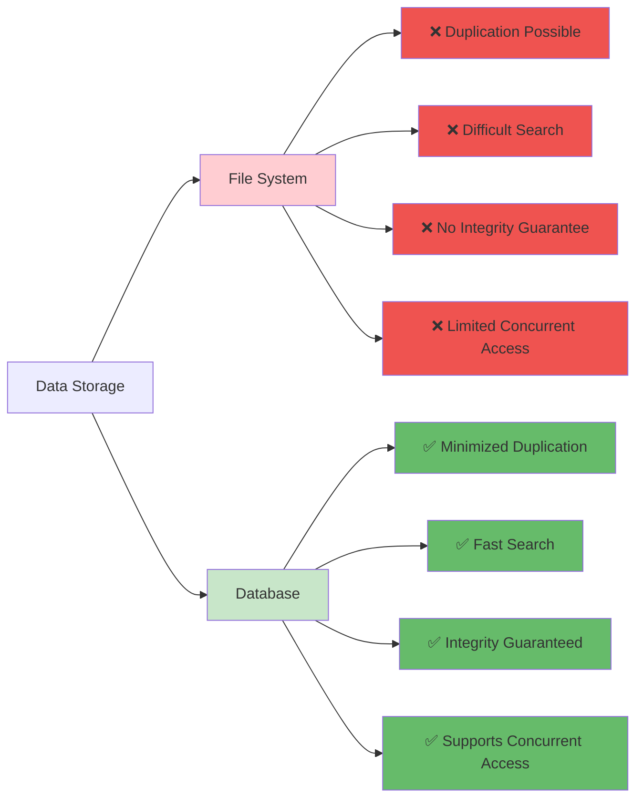
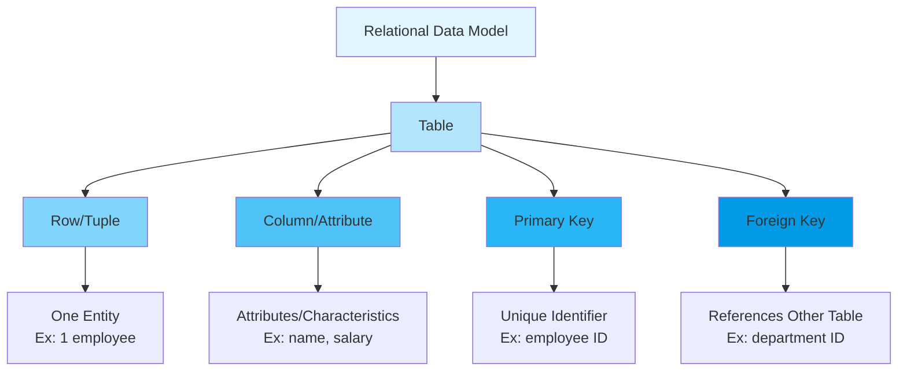
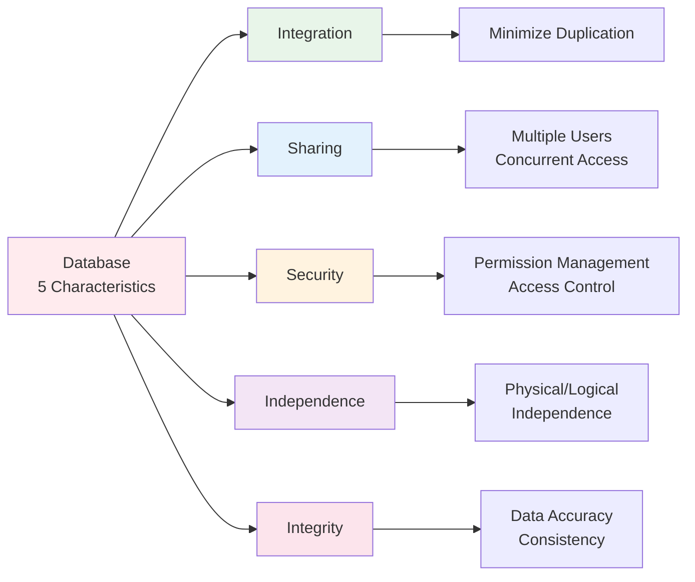

# Chapter 1: Database Overview and Learning Environment Setup

---

## 📋 Course Overview

**Course Topic**: Understanding Database Concepts and Setting Up MySQL Environment | 데이터베이스의 개념 이해 및 MySQL 환경 구축

**Course Objectives**

- Understand the differences between databases and file systems | 데이터베이스와 파일 시스템의 차이 이해
- Learn fundamental concepts of relational databases | 관계형 데이터베이스의 기본 개념 습득
- Install MySQL and set up the basic environment | MySQL 설치 및 기본 환경 구축
- Understand real-world applications of databases | 데이터베이스의 실제 활용 사례 이해

**Required Materials**

- Windows/Mac/Linux Operating System
- MySQL Installation Files
- MySQL Workbench
- Internet Connection

---

## 📚 Part 1: Theoretical Learning

### What You'll Learn in This Section

In this section, we will start with the most fundamental concepts of databases. You will clearly understand the differences between data, information, and databases, and learn the differences between file systems and databases. By understanding the structure of relational databases, the characteristics of MySQL, and the role of DBMS, you will build a theoretical foundation for subsequent practical exercises.

| 이 섹션에서는 데이터베이스의 가장 기본적인 개념부터 시작합니다. 데이터, 정보, 데이터베이스의 차이를 명확히 이해하고, 파일 시스템과 데이터베이스의 차이점을 학습합니다. 또한 관계형 데이터베이스의 구조와 MySQL의 특징, 그리고 DBMS의 역할을 이해함으로써 이후 실습을 위한 이론적 기초를 다집니다.

### 1-1. Database Concepts

#### **Data vs Information vs Database**

```
Data
├─ Definition: Facts or numbers collected from the real world
├─ Example: Student ID 202401001, Name "Kim Chulsu", GPA 3.8
└─ Characteristics: Simple facts, no meaning

Information
├─ Definition: Data processed to give it meaning
├─ Example: "5 students in AI Software Department have GPA 3.8 or higher"
└─ Characteristics: Meaningful, decision-making tool

Database
├─ Definition: A collection of data stored so that multiple users
│             of a specific organization can share and operate it
├─ Characteristics: Integration, storage, sharing, operability
└─ Purpose: Creating information, supporting decision-making
```

#### **File System vs Database**

| Feature           | File System       | Database           |
| ----------------- | ----------------- | ------------------ |
| Storage Method    | Individual Files  | Integrated Data    |
| Duplication       | High              | Minimized          |
| Access Method     | Program-dependent | Independent Access |
| Security          | Low               | High               |
| Efficiency        | Low               | High               |
| Concurrent Access | Difficult         | Easy               |
| Examples          | Excel, CSV        | MySQL, Oracle      |

**Comparison Example**

Managing Student Information in File System | 파일 시스템에서의 학생 정보 관리:

- student_basic_info.csv
- student_grades.csv
- student_attendance.csv
  → Duplication possible, consistency problems occur | 중복 가능, 일관성 문제 발생

Managing Student Information in Database | 데이터베이스에서의 학생 정보 관리:

- student table
  - student_id (Student ID | 학번)
  - name (Name | 이름)
  - gpa (GPA | 학점)
  - attendance (Attendance | 출석)
    → Integrated management, no duplication | 통합 관리, 중복 제거



---

### 1-2. Relational Database (RDBMS) Concepts

#### **What is RDBMS?**

```
RDBMS (Relational Database Management System)

Characteristics:
1. Tables composed of rows and columns
2. Establishing relationships between tables
3. Manipulating data with SQL statements
4. Guaranteeing data integrity
5. Supporting transaction processing
```

#### **Basic Terminology**

```
Table
├─ Definition: A set of data composed of rows and columns
└─ Example: student (student information table)

Row = Record
├─ Definition: One line of a table
└─ Example: 202401001, Kim Chulsu, AI Software Department

Column = Attribute
├─ Definition: One item in a table
└─ Example: student_id, name, department

Primary Key
├─ Definition: A column that uniquely identifies each row
└─ Example: student_id (No duplicates, no NULL)

Foreign Key
├─ Definition: References the primary key of another table
└─ Example: professor_id in course table
```



---

### 1-3. Introduction to MySQL

#### **What is MySQL?**

```
MySQL (My Structured Query Language)

Characteristics:
1. Open-source database
2. Free (commercial support available for fee)
3. High performance and stability
4. Widely used in web applications
5. Core of LAMP/LEMP stack

Versions:
- MySQL 5.7 (previous version)
- MySQL 8.0 (current standard)
- MariaDB (MySQL-compatible open source)

Why Choose MySQL:
✓ Easy to learn
✓ Simple installation
✓ Active community
✓ Industry standard
✓ Widely used in Korea
```

#### **Comparison with Other RDBMS**

| Feature               | MySQL              | Oracle            | SQL Server        | PostgreSQL |
| --------------------- | ------------------ | ----------------- | ----------------- | ---------- |
| Price                 | Free               | Very Expensive    | Expensive         | Free       |
| Learning Curve        | Easy               | Difficult         | Moderate          | Moderate   |
| Web Use               | Very Good          | Enterprise        | Enterprise        | Good       |
| Market Share in Korea | High               | High              | Moderate          | Low        |
| Recommended For       | Beginners, Web Dev | Large Enterprises | Large Enterprises | Developers |

---

### 1-4. Advantages of Databases

#### **Benefits of Database Adoption**

```
Advantage 1: Data Integrity
├─ Prevent incorrect data entry through constraints
├─ Maintain data consistency
└─ Example: GPA must be between 0-4.5

Advantage 2: Enhanced Security
├─ User permission management
├─ Encryption support
└─ Access control

Advantage 3: Data Sharing
├─ Simultaneous access by multiple users
├─ Remote access through network
└─ Improved collaboration efficiency

Advantage 4: Performance Optimization
├─ Improved search speed through indexing
├─ Query optimization
└─ Handling large-scale data

Advantage 5: Recovery Capability
├─ Backup and recovery functions
├─ Transaction processing
└─ Disaster recovery
```



---

### 1-5. Role of Database Management System

```
Role of DBMS

1. Data Definition
   └─ DDL: CREATE, ALTER, DROP

2. Data Manipulation
   └─ DML: SELECT, INSERT, UPDATE, DELETE

3. Data Control
   └─ DCL: GRANT, REVOKE

4. Data Integrity Management
   └─ Constraints, Triggers

5. Concurrency Control
   └─ Managing simultaneous access by multiple users

6. Backup and Recovery
   └─ Preparing for failures
```

---

## 📚 Part 2: MySQL Installation and Environment Setup

### What You'll Learn in This Section

In this section, you will learn how to actually install MySQL and configure the basic environment. You will follow the installation procedure on Windows step by step, and verify that MySQL Workbench runs properly. This is a practical exercise where you apply the concepts learned in theory to a real environment.

| 이 섹션에서는 실제로 MySQL을 설치하고 기본 환경을 구성하는 방법을 배웁니다. Windows 운영체제에서의 설치 절차를 단계별로 따라가며, MySQL Workbench를 실행하여 정상적으로 작동하는지 확인합니다. 이론에서 배운 개념을 실제 환경에서 적용해보는 실습입니다.

### 2-1. MySQL Installation (Windows Example)

**Step 1: Download MySQL**

- Visit https://dev.mysql.com/downloads/mysql/
- Select MySQL 8.0 version
- Download Windows version

**Step 2: Run Installation Program**

- Run mysql-8.0.x-winx64.msi
- Setup Type: Select Developer Default
- Verify that MySQL Server and MySQL Workbench are included

**Step 3: Configuration**

- Port: 3306 (default)
- Configuration Type: Development Machine
- Authentication Method: MySQL 8.0 compatible

**Step 4: Initial Setup**

- Set root user password
- Verify default port 3306
- Register as Windows Service

**Step 5: Complete**

- Set MySQL server to start automatically
- Verify MySQL Workbench installation

### 2-2. First Launch of MySQL Workbench

1. Launch MySQL Workbench
2. Click on Local instance MySQL
3. Enter password
4. Verify successful connection

---

## 💻 Part 3: Practice

### What You'll Learn in This Section

In this section, you will verify that MySQL has been successfully installed and create the basic structure of a database and table yourself. You will enter SQL commands to verify settings and gain basic experience in actually storing and querying data.

| 이 섹션에서는 MySQL 설치가 성공적으로 이루어졌는지 확인하고, 데이터베이스와 테이블의 기본 구조를 직접 만들어봅니다. SQL 명령어를 입력하여 설정을 확인하고, 실제로 데이터를 저장하고 조회하는 기초 경험을 얻게 됩니다.

### 3-1. Concept Verification Practice

**Practice 1-1: Verify MySQL Installation**

```sql
-- Check MySQL version
SELECT VERSION();

-- Check current database
SELECT DATABASE();

-- Check current user
SELECT USER();

-- Check MySQL status
SHOW STATUS;
```

**Practice 1-2: Basic System Information**

```sql
-- List all databases
SHOW DATABASES;

-- Check MySQL port
SHOW VARIABLES LIKE 'port';

-- Check character set
SHOW VARIABLES LIKE 'character_set%';
```

---

### 3-2. Basic Database and Table Creation Practice

**Practice 1-3: Create Database**

```sql
-- Create database
CREATE DATABASE ch1_practice CHARACTER SET utf8mb4;

-- Select database
USE ch1_practice;

-- Check created database
SHOW DATABASES;

-- Check current database
SELECT DATABASE();
```

**Practice 1-4: Create Basic Table**

```sql
-- Create student table
CREATE TABLE student (
    student_id INT PRIMARY KEY,
    name VARCHAR(30) NOT NULL,
    department VARCHAR(30),
    gpa DECIMAL(3, 2)
) CHARACTER SET utf8mb4;

-- Check table structure
DESC student;
SHOW CREATE TABLE student;

-- Check all tables
SHOW TABLES;
```

**Practice 1-5: Insert Sample Data**

```sql
-- Insert data
INSERT INTO student VALUES
(202401001, '김철수', 'AI소프트웨어학과', 3.85),
(202401002, '이영희', 'AI소프트웨어학과', 3.92),
(202401003, '박보영', 'AI소프트웨어학과', 3.45);

-- Check data
SELECT * FROM student;
```

---

### 3-3. Comprehensive Practice

**Practice 1-6: Complete Configuration Verification**

```sql
-- 1. Check current status
SELECT '=== MySQL Connection Status ===' AS info;
SELECT VERSION() AS MySQL_Version;
SELECT USER() AS Current_User;
SELECT DATABASE() AS Current_Database;

-- 2. Check table status
SELECT '=== Table Information ===' AS info;
SHOW TABLES;
DESC student;

-- 3. Check data
SELECT '=== Stored Data ===' AS info;
SELECT COUNT(*) AS Total_Students FROM student;
SELECT AVG(gpa) AS Average_GPA FROM student;
```

---

## 📝 Part 4: Assignment Instructions

### Theoretical Assignments

**Assignment 1**: Explain the relationship between data and information and provide an example of how this applies in daily life. For example, it would be helpful to explain how data collected in a course registration system is converted into information. | 데이터와 정보의 관계를 설명하고, 일상 생활에서 이를 적용한 사례를 들어주세요. 예를 들어, 수강 신청 시스템에서 수집되는 데이터가 어떻게 정보로 변환되는지 설명하면 좋습니다.

**Assignment 2**: Explain the problems with managing student information using a file system and compare and analyze the improvements when using a database. | 파일 시스템을 이용하여 학생 정보를 관리하는 경우의 문제점을 설명하고, 데이터베이스를 사용했을 때의 개선 사항을 비교 분석하세요.

**Assignment 3**: Explain the characteristics of relational databases and why MySQL is a representative example of relational databases. | 관계형 데이터베이스의 특징과 MySQL이 관계형 데이터베이스의 대표적인 예시인 이유를 설명하세요.

**Assignment 4**: Describe the six major roles of DBMS and explain how each role is important in actual work. | DBMS의 주요 역할 여섯 가지를 설명하고, 각각의 역할이 실제 업무에서 어떻게 중요한지 서술하세요.

**Assignment 5**: Explain the five major advantages of implementing a database and discuss how each advantage impacts organizational competitiveness. | 데이터베이스를 도입했을 때의 다섯 가지 주요 장점을 설명하고, 각 장점이 조직의 경쟁력에 어떤 영향을 미치는지 논의하세요.

Submission Format: Word or PDF document (1-2 pages)

---

### Practical Assignments

**Assignment 1**: Run basic commands such as SELECT VERSION(), SELECT USER(), SELECT DATABASE() to verify that MySQL has been installed correctly, and prove the installation is complete by attaching screenshots of the results. | MySQL이 정상적으로 설치되었는지 확인하기 위해 SELECT VERSION(), SELECT USER(), SELECT DATABASE() 등의 기본 명령어를 실행하고, 그 결과를 스크린샷으로 첨부하여 설치 완료를 증명하세요.

**Assignment 2**: Create a new database named 'ch1_mydata' and verify that it has been created correctly using the SHOW DATABASES command, then attach a screenshot of the results. | 'ch1_mydata'라는 이름의 새로운 데이터베이스를 생성하고, 그 데이터베이스가 제대로 생성되었는지 SHOW DATABASES 명령어로 확인한 후 결과 스크린샷을 첨부하세요.

**Assignment 3**: Create a table named product in the ch1_mydata database with the following columns: product_id (integer, primary key), product_name (variable character 50), price (integer), stock (integer). After creation, verify that the table has been created correctly. | ch1_mydata 데이터베이스 내에 product라는 이름의 테이블을 다음 열들로 생성하세요. 열은 product_id (정수형, 기본키), product_name (가변 문자형 50자), price (정수형), stock (정수형)으로 구성되어야 합니다. 생성 후 테이블이 제대로 만들어졌는지 확인하세요.

**Assignment 4**: Check the structure of the product table using the DESC command to verify that all columns have been created correctly as designed, and submit the result as a screenshot. | product 테이블의 구조를 DESC 명령어로 조회하여 설계한 대로 모든 열이 올바르게 생성되었는지 확인하고, 그 결과를 스크린샷으로 제출하세요.

**Assignment 5**: Insert at least 3 products into the product table. Each product must be a real product and prices and inventory quantities must be realistic. After inserting the data, query all data using a SELECT statement to verify that it has been saved correctly and attach the result as a screenshot. | product 테이블에 최소 3개 이상의 상품 데이터를 입력하세요. 각 상품은 실제 존재하는 상품이어야 하며, 가격과 재고량은 현실적인 수치여야 합니다. 데이터를 입력한 후 SELECT 문으로 모든 데이터를 조회하여 제대로 저장되었는지 확인하고 결과를 스크린샷으로 첨부하세요.

Submission Format: SQL file (Ch1_Practice_[StudentID].sql) and collection of screenshots

---

Thank you for your hard work.

Prof. Cho Jeong-Hyun (peterchokr@gmail.com). Yeungnam University College
