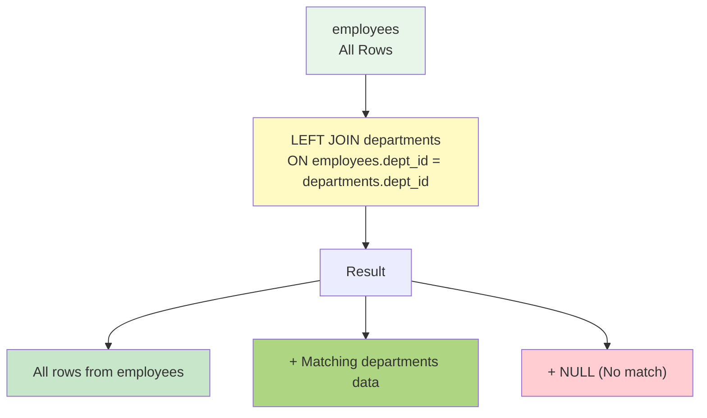
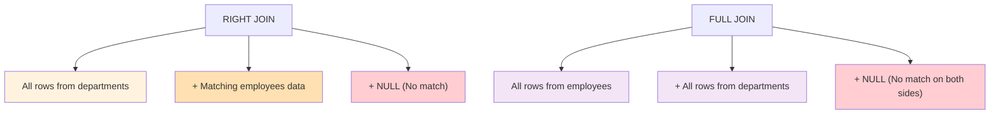
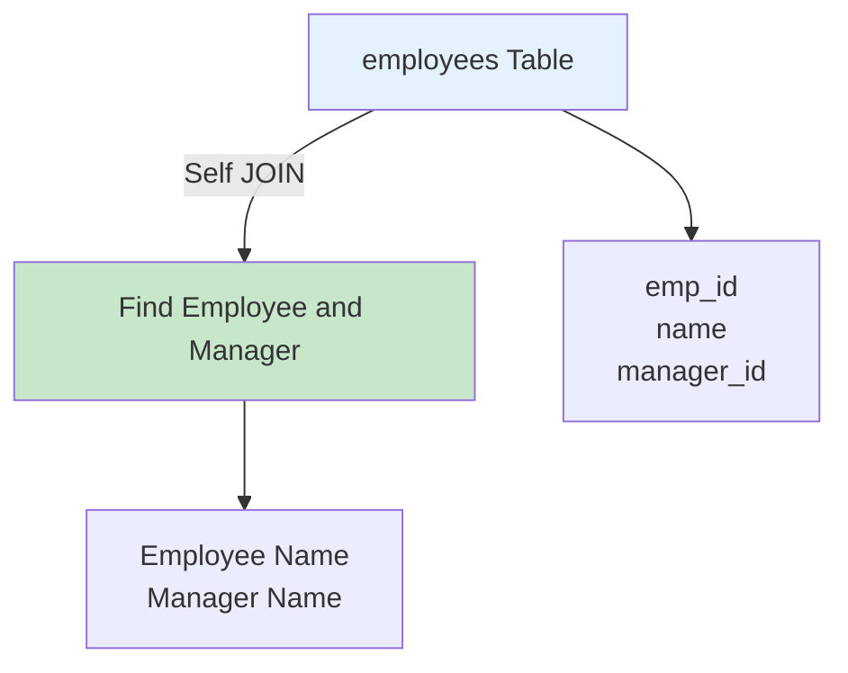
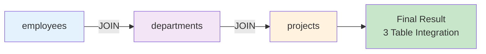
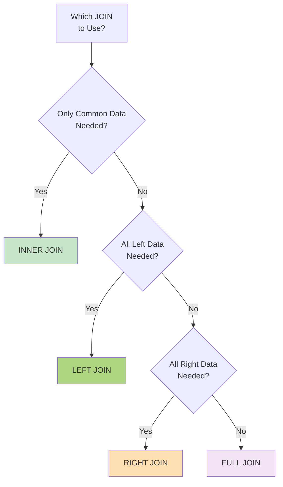

# Chapter 6: JOIN (Advanced)

---

## 📖 Course Overview

In this chapter, you will learn advanced concepts of JOIN operations that combine two or more tables in relational databases. Based on the basic INNER JOIN learned in the previous chapter, this chapter covers various types of JOIN (LEFT JOIN, RIGHT JOIN, FULL OUTER JOIN, CROSS JOIN, Self Join), methods for combining multiple tables simultaneously, and performance optimization of JOIN. 

The goal is to develop the ability to handle complex data query requirements in practice. 

| 이 장에서는 관계형 데이터베이스에서 두 개 이상의 테이블을 결합하는 JOIN 연산의 고급 개념을 학습합니다. 이전 장에서 배운 기본 INNER JOIN을 바탕으로, 다양한 종류의 JOIN(LEFT JOIN, RIGHT JOIN, FULL OUTER JOIN, CROSS JOIN, Self Join)과 여러 테이블을 동시에 결합하는 방법, 그리고 JOIN의 성능 최적화에 대해 다룹니다. 실무에서 복잡한 데이터 조회 요구사항을 처리할 수 있는 능력을 개발하는 것이 목표입니다.

---

## 📚 Part 1: Theoretical Learning

### What You'll Learn in This Section

- Concept and characteristics of LEFT JOIN (left outer join)
- Concept and characteristics of RIGHT JOIN (right outer join)
- Concept of FULL OUTER JOIN (full outer join)
- Concept and usage of CROSS JOIN (cross join)
- Self Join (join with itself)
- JOIN of multiple tables (3 or more)
- JOIN conditions and performance considerations

---

### 6.1 LEFT JOIN (Left Outer Join)

LEFT JOIN maintains all rows from the left table and adds matching rows from the right table. If there is no matching row in the right table, NULL is displayed. 

| LEFT JOIN은 왼쪽 테이블의 모든 행을 유지하고, 오른쪽 테이블에서 일치하는 행을 첨가합니다. 오른쪽 테이블에서 일치하지 않는 행이 없으면 NULL이 표시됩니다.

**Syntax:**

```sql
SELECT column_list
FROM table1
LEFT JOIN table2
ON table1.key = table2.key;
```

**Characteristics:**

- All data from the left table is always included in results
- Unmatched cases from the right table are displayed as NULL
- Very commonly used in practice
- Useful for checking data deficiency

**Example:**

```sql
SELECT e.employee_id, e.name, d.department_name
FROM employees e
LEFT JOIN departments d
ON e.dept_id = d.dept_id;
```



---

### 6.2 RIGHT JOIN (Right Outer Join)

RIGHT JOIN is opposite to LEFT JOIN, maintaining all rows from the right table and adding matching rows from the left table. 

RIGHT JOIN은 LEFT JOIN과 반대로, 오른쪽 테이블의 모든 행을 유지하고 왼쪽 테이블에서 일치하는 행을 첨가합니다.

**Syntax:**

```sql
SELECT column_list
FROM table1
RIGHT JOIN table2
ON table1.key = table2.key;
```

**Characteristics:**

- All data from the right table is always included in results
- Unmatched cases from the left table are displayed as NULL
- Same result can be obtained by changing table order to LEFT JOIN



---

### 6.3 FULL OUTER JOIN (Full Outer Join)

FULL OUTER JOIN maintains all rows from both tables, and unmatched parts are displayed as NULL. **Note:** MySQL does not directly support FULL OUTER JOIN, so it is implemented by combining LEFT JOIN and RIGHT JOIN with UNION. 

| FULL OUTER JOIN은 양쪽 테이블의 모든 행을 유지하고, 일치하지 않는 부분은 NULL로 표시합니다. MySQL은 FULL OUTER JOIN을 직접 지원하지 않으므로, LEFT JOIN과 RIGHT JOIN을 UNION으로 결합하여 구현합니다.

**Implementation Method:**

```sql
SELECT column_list
FROM table1
LEFT JOIN table2 ON table1.key = table2.key
UNION
SELECT column_list
FROM table1
RIGHT JOIN table2 ON table1.key = table2.key;
```

---

### 6.4 CROSS JOIN (Cross Join)

CROSS JOIN combines all rows from both tables to generate a Cartesian Product.

| CROSS JOIN은 두 테이블의 모든 행을 결합하여 카르테시안 곱(Cartesian Product)을 생성합니다.

**Syntax:**

```sql
SELECT column_list
FROM table1
CROSS JOIN table2;
-- or
SELECT column_list
FROM table1, table2;
```

**Characteristics:**

- Result row count = table1 rows × table2 rows
- Can generate very large result sets
- Used when all combinations are needed without conditions

---

### 6.5 Self Join (Join with itself)

Self Join is a join that uses the same table twice to find relationships between table rows. 

| Self Join은 같은 테이블을 두 번 사용하여 테이블의 행들 사이의 관계를 찾는 조인입니다.

**Syntax:**

```sql
SELECT column_list
FROM table1 AS t1
JOIN table1 AS t2
ON t1.key = t2.key;
```

**Use Cases:**

- Finding employee's superior (manager)
- Querying hierarchical structure data
- Finding employees in the same department

**Example:**

```sql
SELECT e1.name AS employee_name, e2.name AS manager_name
FROM employees e1
LEFT JOIN employees e2
ON e1.manager_id = e2.employee_id;
```



---

### 6.6 Multiple Table JOIN (3 or more)

In practice, it is frequently necessary to combine 3 or more tables. | 실무에서는 3개 이상의 테이블을 결합해야 하는 경우가 빈번합니다.

**Example:**

```sql
SELECT e.name, d.department_name, s.salary_grade
FROM employees e
JOIN departments d ON e.dept_id = d.dept_id
JOIN salary_grades s ON e.salary BETWEEN s.min_salary AND s.max_salary;
```

**Important Points:**

- Clearly write each JOIN condition
- Order is important when using LEFT JOIN
- Improve readability with table aliases (AS)



---

### 6.7 JOIN Selection Criteria



---

### 6.8 JOIN Performance Optimization

**Performance Improvement Considerations:**

1. **Create appropriate indexes**

   - Set indexes on columns used in JOIN conditions
   - Consider indexes for WHERE condition columns
2. **JOIN order**

   - JOIN smaller tables first
   - Process tables with fewer results first
3. **SELECT only needed columns**

   - Instead of SELECT *, explicitly specify needed columns
   - Avoid querying unnecessary columns
4. **Explicit join conditions**

   - Use explicit JOIN syntax (INNER JOIN, LEFT JOIN, etc.)
   - Avoid implicit join (comma)

---

## 📚 Part 2: Sample Data

### employees Table

```sql
CREATE TABLE employees (
    employee_id INT PRIMARY KEY AUTO_INCREMENT,
    name VARCHAR(50) NOT NULL,
    dept_id INT,
    manager_id INT,
    salary DECIMAL(10, 2)
);

INSERT INTO employees VALUES
(1, 'Kim Chulsu', 1, NULL, 5000000),
(2, 'Lee Younghee', 1, 1, 4000000),
(3, 'Park Minjun', 2, 1, 4500000),
(4, 'Choi Sunsin', 2, 3, 3500000),
(5, 'Kang Gamchan', 3, 1, 4200000),
(6, 'Lee Sunsin', 3, 5, 3800000),
(7, 'Jang Bogo', 1, 1, 3200000);
```

### departments Table

```sql
CREATE TABLE departments (
    dept_id INT PRIMARY KEY AUTO_INCREMENT,
    department_name VARCHAR(50) NOT NULL,
    location VARCHAR(50)
);

INSERT INTO departments VALUES
(1, 'Sales', 'Seoul'),
(2, 'Technology', 'Daejeon'),
(3, 'HR', 'Seoul'),
(4, 'Finance', 'Busan');
```

### salary_grades Table

```sql
CREATE TABLE salary_grades (
    grade CHAR(1) PRIMARY KEY,
    min_salary DECIMAL(10, 2),
    max_salary DECIMAL(10, 2)
);

INSERT INTO salary_grades VALUES
('A', 5000000, 6000000),
('B', 4000000, 4999999),
('C', 3000000, 3999999),
('D', 2000000, 2999999);
```

---

## 💻 Part 3: Practice

### What You'll Learn in This Section

- Practical application of various JOIN types | 다양한 JOIN 유형의 실전 활용
- Writing complex JOIN queries | 복합 JOIN 쿼리 작성
- NULL value handling methods | NULL 값 처리 방법
- Result verification and interpretation | 결과 검증 및 해석

---

### 6-1. LEFT JOIN Basics

Query all employees and their department names from the employees table. Employees without departments should also be included. | employees 테이블에서 모든 직원과 그들이 속한 부서명을 조회하세요. 부서가 없는 직원도 포함되어야 합니다.

```sql
SELECT e.employee_id, e.name, d.department_name
FROM employees e
LEFT JOIN departments d
ON e.dept_id = d.dept_id;
```

---

### 6-2. LEFT JOIN with WHERE Condition

LEFT JOIN employees and departments to query employees in Seoul departments only. (Exclude cases where department is NULL) | employees와 departments를 LEFT JOIN하여 서울 지역 부서의 직원들만 조회하세요. (부서가 NULL인 경우는 제외)

```sql
SELECT e.employee_id, e.name, d.department_name, d.location
FROM employees e
LEFT JOIN departments d
ON e.dept_id = d.dept_id
WHERE d.location = 'Seoul';
```

---

### 6-3. RIGHT JOIN Usage

RIGHT JOIN departments and employees to query all departments and employee count for each department. | departments와 employees를 RIGHT JOIN하여 모든 부서와 각 부서의 직원 수를 조회하세요.

```sql
SELECT d.department_name, COUNT(e.employee_id) AS employee_count
FROM employees e
RIGHT JOIN departments d
ON e.dept_id = d.dept_id
GROUP BY d.dept_id, d.department_name;
```

---

### 6-4. Self Join Basics

Query each employee's name and their manager's (supervisor's) name together from the employees table. | employees 테이블에서 각 직원의 이름과 상급자(관리자)의 이름을 함께 조회하세요.

```sql
SELECT e1.name AS employee_name, e2.name AS manager_name
FROM employees e1
LEFT JOIN employees e2
ON e1.manager_id = e2.employee_id;
```

---

### 6-5. Self Join to Find Colleagues

Find all pairs of employees in the same department and query employee1 and employee2. | 같은 부서에 속한 직원들의 쌍을 모두 찾아 직원1과 직원2를 조회하세요.

```sql
SELECT e1.name AS employee1, e2.name AS employee2, e1.dept_id
FROM employees e1
JOIN employees e2
ON e1.dept_id = e2.dept_id
WHERE e1.employee_id < e2.employee_id;
```

---

### 6-6. Understanding CROSS JOIN

CROSS JOIN departments and salary grades to generate all combinations. | 부서와 급여등급을 CROSS JOIN하여 모든 조합을 생성하세요.

```sql
SELECT d.department_name, s.grade
FROM departments d
CROSS JOIN salary_grades s
ORDER BY d.department_name, s.grade;
```

---

### 6-7. JOIN 3 Tables

JOIN employees, departments, and salary_grades to query employee name, department name, and salary grade. | employees, departments, salary_grades를 JOIN하여 직원명, 부서명, 급여등급을 조회하세요.

```sql
SELECT e.employee_id, e.name, d.department_name, s.grade
FROM employees e
JOIN departments d
ON e.dept_id = d.dept_id
JOIN salary_grades s
ON e.salary BETWEEN s.min_salary AND s.max_salary;
```

---

### 6-8. LEFT JOIN Chaining

LEFT JOIN employees and departments to query employee name and department name. | employees LEFT JOIN departments 하여 직원명, 부서명을 조회하세요.

```sql
SELECT e.employee_id, e.name, d.department_name, d.location
FROM employees e
LEFT JOIN departments d
ON e.dept_id = d.dept_id
ORDER BY e.employee_id;
```

---

### 6-9. NULL Value Handling

Replace NULL values with different values in LEFT JOIN results and query. | LEFT JOIN 결과에서 NULL 값을 다른 값으로 대체하여 조회하세요.

```sql
SELECT e.employee_id, e.name, 
       IFNULL(d.department_name, 'Unassigned') AS department_name,
       COALESCE(d.location, 'TBD') AS location
FROM employees e
LEFT JOIN departments d
ON e.dept_id = d.dept_id;
```

---

### 6-10. Aggregation on Joined Table

JOIN employees and departments to query employee count by department. | employees와 departments를 JOIN하여 부서별 직원 수를 조회하세요.

```sql
SELECT d.department_name, COUNT(e.employee_id) AS employee_count
FROM employees e
JOIN departments d
ON e.dept_id = d.dept_id
GROUP BY d.dept_id, d.department_name;
```

---

### 6-11. Duplicate Removal

Remove duplicates that occur when JOINing multiple tables using DISTINCT. | 여러 테이블을 JOIN할 때 발생하는 중복을 DISTINCT로 제거하세요.

```sql
SELECT DISTINCT d.department_name
FROM employees e
JOIN departments d
ON e.dept_id = d.dept_id;
```

---

### 6-12. Finding 'Missing Data' with LEFT JOIN

LEFT JOIN employees and departments to find departments without employees. | employees와 departments를 LEFT JOIN하여 직원이 없는 부서를 조회하세요.

```sql
SELECT d.department_name
FROM departments d
LEFT JOIN employees e
ON d.dept_id = e.dept_id
WHERE e.employee_id IS NULL;
```

---

### 6-13. Self Join to Express Hierarchy

Express the relationship between department heads (manager_id is NULL) and their subordinates in employees. | employees에서 부서장(manager_id가 NULL)과 그 부하직원들의 관계를 표현하세요.

```sql
SELECT manager.name AS department_head, employee.name AS subordinate
FROM employees employee
LEFT JOIN employees manager
ON employee.manager_id = manager.employee_id
WHERE manager.manager_id IS NULL
ORDER BY manager.name, employee.name;
```

---

### 6-14. JOIN Result Sorting

Sort by multiple columns after JOINing multiple tables. | 여러 테이블을 JOIN한 후 다중 열로 정렬하세요.

```sql
SELECT e.name, d.department_name, e.salary
FROM employees e
JOIN departments d
ON e.dept_id = d.dept_id
ORDER BY d.department_name ASC, e.salary DESC;
```

---

### 6-15. JOIN and LIMIT

Query only top N rows from JOIN results. | JOIN된 결과에서 상위 N개 행만 조회하세요.

```sql
SELECT e.name, e.salary, d.department_name
FROM employees e
JOIN departments d
ON e.dept_id = d.dept_id
ORDER BY e.salary DESC
LIMIT 5;
```

---

### 6-16. INNER JOIN vs LEFT JOIN

Compare the number of result rows between INNER JOIN and LEFT JOIN. | INNER JOIN과 LEFT JOIN의 결과 행 수를 비교하세요.

```sql
-- INNER JOIN
SELECT COUNT(*) AS inner_join_count
FROM employees e
INNER JOIN departments d
ON e.dept_id = d.dept_id;

-- LEFT JOIN
SELECT COUNT(*) AS left_join_count
FROM employees e
LEFT JOIN departments d
ON e.dept_id = d.dept_id;
```

---

### 6-17. Conditional JOIN

Query different data according to conditions. | 조건에 따라 다른 데이터를 조회하세요.

```sql
SELECT e.name, d.department_name,
       CASE 
           WHEN e.salary >= 5000000 THEN 'High'
           WHEN e.salary >= 4000000 THEN 'Medium'
           ELSE 'Low'
       END AS salary_level
FROM employees e
JOIN departments d
ON e.dept_id = d.dept_id;
```

---

### 6-18. Aggregate Functions with JOIN

Calculate average of JOINed data. | JOIN된 데이터의 평균을 계산하세요.

```sql
SELECT d.department_name, 
       COUNT(e.employee_id) AS emp_count,
       AVG(e.salary) AS avg_salary,
       MAX(e.salary) AS max_salary
FROM employees e
JOIN departments d
ON e.dept_id = d.dept_id
GROUP BY d.dept_id, d.department_name;
```

---

### 6-19. HAVING with JOIN

Apply HAVING conditions to JOINed data. | JOIN된 데이터에 HAVING 조건을 적용하세요.

```sql
SELECT d.department_name, COUNT(e.employee_id) AS emp_count
FROM employees e
JOIN departments d
ON e.dept_id = d.dept_id
GROUP BY d.dept_id, d.department_name
HAVING COUNT(e.employee_id) >= 2;
```

---

### 6-20. Multiple LEFT JOIN Combination

Combine multiple LEFT JOINs together. | 여러 개의 LEFT JOIN을 조합하세요.

```sql
SELECT e.name, d.department_name, s.grade
FROM employees e
LEFT JOIN departments d
ON e.dept_id = d.dept_id
LEFT JOIN salary_grades s
ON e.salary BETWEEN s.min_salary AND s.max_salary
ORDER BY e.employee_id;
```

---

### 6-21. Anti Join (NOT EXISTS)

Query data that does not meet specific conditions. | 특정 조건을 만족하지 않는 데이터를 조회하세요.

```sql
SELECT d.department_name
FROM departments d
WHERE NOT EXISTS (
    SELECT 1 FROM employees e
    WHERE e.dept_id = d.dept_id
);
```

---

### 6-22. Semi Join (EXISTS)

Query only data that meets specific conditions. | 특정 조건을 만족하는 데이터만 조회하세요.

```sql
SELECT d.department_name
FROM departments d
WHERE EXISTS (
    SELECT 1 FROM employees e
    WHERE e.dept_id = d.dept_id AND e.salary > 4000000
);
```

---

### 6-23. FULL OUTER JOIN Implementation

Implement FULL OUTER JOIN by combining LEFT JOIN and RIGHT JOIN with UNION. | LEFT JOIN과 RIGHT JOIN을 UNION으로 결합하여 FULL OUTER JOIN을 구현하세요.

```sql
SELECT COALESCE(e.employee_id, 0) AS emp_id,
       COALESCE(e.name, 'None') AS emp_name,
       COALESCE(d.department_name, 'None') AS dept_name
FROM employees e
LEFT JOIN departments d
ON e.dept_id = d.dept_id
UNION
SELECT COALESCE(e.employee_id, 0) AS emp_id,
       COALESCE(e.name, 'None') AS emp_name,
       COALESCE(d.department_name, 'None') AS dept_name
FROM employees e
RIGHT JOIN departments d
ON e.dept_id = d.dept_id;
```

---

### 6-24. Self Join for Range Query

Query ranges from the same table. | 같은 테이블에서 범위를 조회하세요.

```sql
SELECT s1.grade AS current_grade, s2.grade AS next_grade
FROM salary_grades s1
JOIN salary_grades s2
ON s1.max_salary < s2.min_salary;
```

---

### 6-25. Complex JOIN Condition

JOIN using two or more conditions. | 두 개 이상의 조건으로 JOIN하세요.

```sql
SELECT e.name, d.department_name
FROM employees e
JOIN departments d
ON e.dept_id = d.dept_id
WHERE e.salary > 4000000 AND d.location = 'Seoul';
```

---

### 6-26. ORDER BY on JOIN Result

Sort JOINed results. | JOIN된 결과를 정렬하세요.

```sql
SELECT e.name, e.salary, d.department_name
FROM employees e
JOIN departments d
ON e.dept_id = d.dept_id
ORDER BY e.salary DESC, e.name ASC;
```

---

### 6-27. String Functions with JOIN

Use string functions on JOIN results. | JOIN 결과에 문자열 함수를 사용하세요.

```sql
SELECT CONCAT(e.name, ' - ', d.department_name) AS employee_info,
       e.salary
FROM employees e
JOIN departments d
ON e.dept_id = d.dept_id;
```

---

### 6-28. Date Functions with JOIN

Use date functions on JOIN results. | JOIN 결과에 날짜 함수를 사용하세요.

```sql
SELECT e.name, YEAR(e.hire_date) AS hire_year, d.department_name
FROM employees e
LEFT JOIN departments d
ON e.dept_id = d.dept_id
WHERE YEAR(e.hire_date) >= 2020;
```

---

### 6-29. Conditional Aggregation

Perform conditional aggregation on JOIN results. | JOIN 결과에서 조건부 집계를 수행하세요.

```sql
SELECT d.department_name,
       SUM(CASE WHEN e.salary > 4000000 THEN 1 ELSE 0 END) AS high_salary_count,
       SUM(CASE WHEN e.salary <= 4000000 THEN 1 ELSE 0 END) AS low_salary_count
FROM employees e
JOIN departments d
ON e.dept_id = d.dept_id
GROUP BY d.dept_id, d.department_name;
```

---

### 6-30. NULL Comparison in JOIN

JOIN with special NULL value handling. | NULL 값을 특별하게 처리하는 JOIN을 하세요.

```sql
SELECT e.name, d.department_name
FROM employees e
LEFT JOIN departments d
ON e.dept_id = d.dept_id
ORDER BY d.department_name IS NULL, e.name;
```

---

### 6-31. Multiple Table Search Conditions

Check conditions from multiple tables simultaneously. | 여러 테이블에서 동시에 조건을 확인하세요.

```sql
SELECT e.name, d.department_name, e.salary
FROM employees e
JOIN departments d
ON e.dept_id = d.dept_id
WHERE e.salary > (SELECT AVG(salary) FROM employees)
AND d.location = 'Seoul';
```

---

### 6-32. JOIN vs IN Clause

Compare JOIN method with IN clause method. | JOIN을 IN 절로 대체하여 비교하세요.

```sql
-- JOIN method
SELECT e.name
FROM employees e
JOIN departments d
ON e.dept_id = d.dept_id
WHERE d.location = 'Seoul';

-- IN clause method
SELECT name
FROM employees
WHERE dept_id IN (SELECT dept_id FROM departments WHERE location = 'Seoul');
```

---

### 6-33. Analyzing JOIN Performance with EXPLAIN

Analyze JOIN execution plan using EXPLAIN. | EXPLAIN을 사용하여 JOIN의 실행 계획을 분석하세요.

```sql
EXPLAIN SELECT e.name, d.department_name
FROM employees e
JOIN departments d
ON e.dept_id = d.dept_id;
```

---

### 6-34. JOIN with Indexed Columns

JOIN using columns with indexes to optimize performance. | 인덱스가 있는 열로 JOIN하여 성능을 최적화하세요.

```sql
-- Fast when dept_id has foreign key index
SELECT e.name, d.department_name
FROM employees e
JOIN departments d
ON e.dept_id = d.dept_id;
```

---

### 6-35. Changing JOIN Order

Compare performance by changing table order. | 테이블 순서를 변경하여 성능을 비교하세요.

```sql
-- Method 1: Smaller table first
SELECT e.name, d.department_name
FROM departments d
JOIN employees e
ON d.dept_id = e.dept_id;

-- Method 2: Table with more constraints first
SELECT e.name, d.department_name
FROM employees e
JOIN departments d
ON e.dept_id = d.dept_id
WHERE e.salary > 4000000;
```

---

### 6-36. Target Table UPDATE with JOIN

UPDATE specific rows using JOIN. | JOIN을 사용하여 특정 조건의 행을 UPDATE하세요.

```sql
UPDATE employees e
JOIN departments d
ON e.dept_id = d.dept_id
SET e.salary = e.salary * 1.1
WHERE d.location = 'Seoul';
```

---

### 6-37. Target Table DELETE with JOIN

DELETE specific rows using JOIN. | JOIN을 사용하여 특정 조건의 행을 DELETE하세요.

```sql
DELETE e FROM employees e
JOIN departments d
ON e.dept_id = d.dept_id
WHERE d.location = 'Busan' AND e.salary < 3500000;
```

---

### 6-38. INSERT SELECT with JOIN

Copy data using JOIN. | JOIN을 사용하여 데이터를 복사하세요.

```sql
INSERT INTO employee_archive (name, department_name, salary)
SELECT e.name, d.department_name, e.salary
FROM employees e
JOIN departments d
ON e.dept_id = d.dept_id
WHERE e.employee_id > 5;
```

---

### 6-39. Complex JOIN Query

Write complex query using multiple conditions and JOINs. | 여러 조건과 JOIN을 사용한 복잡한 쿼리를 작성하세요.

```sql
SELECT e.name, d.department_name, s.grade, 
       COUNT(*) OVER (PARTITION BY d.dept_id) AS dept_emp_count
FROM employees e
JOIN departments d
ON e.dept_id = d.dept_id
LEFT JOIN salary_grades s
ON e.salary BETWEEN s.min_salary AND s.max_salary
WHERE e.salary > 3500000
ORDER BY d.department_name, e.salary DESC;
```

---

### 6-40. Real-World Scenario JOIN

Find eligible employees for salary increase: employees with salary 120% or higher than department average. | 급여 인상 대상 직원 조회: 부서별 평균 급여의 120% 이상인 직원을 찾아세요.

```sql
SELECT e.name, d.department_name, e.salary,
       ROUND(AVG(e2.salary) OVER (PARTITION BY d.dept_id), 0) AS dept_avg
FROM employees e
JOIN departments d
ON e.dept_id = d.dept_id
JOIN employees e2
ON e.dept_id = e2.dept_id
WHERE e.salary > (
    SELECT AVG(salary) * 1.2 
    FROM employees 
    WHERE dept_id = e.dept_id
)
GROUP BY e.employee_id, e.name, d.department_name, e.salary, d.dept_id;
```

---

## 📝 Part 4: Assignment Instructions

### Theoretical Assignments

**Assignment 1**: Explain the differences between LEFT JOIN and RIGHT JOIN and describe when each should be used with practical examples. Also show how to implement the same result with LEFT JOIN and RIGHT JOIN. | LEFT JOIN과 RIGHT JOIN의 차이점을 설명하고, 언제 각각을 사용해야 하는지 실무 사례를 들어 서술하세요. 같은 결과를 LEFT JOIN과 RIGHT JOIN으로 구현하는 방법도 보여주세요.

**Assignment 2**: Explain the concept of Self Join and present 3 or more cases where Self Join is necessary, such as employee-manager relationships and category hierarchies. | Self Join의 개념을 설명하고, 직원과 관리자 관계, 범주 대분류와 소분류 관계 등 Self Join이 필요한 사례를 3가지 이상 제시하세요.

**Assignment 3**: Explain how to implement FULL OUTER JOIN in MySQL and write an implementation query using LEFT JOIN, RIGHT JOIN, and UNION. Analyze situations where FULL OUTER JOIN is necessary. | FULL OUTER JOIN을 MySQL에서 구현하는 방법을 설명하고, LEFT JOIN, RIGHT JOIN, UNION을 사용한 구현 쿼리를 작성하세요. FULL OUTER JOIN이 필요한 상황을 분석하세요.

**Assignment 4**: Describe considerations when JOINing 3 or more tables. Discuss cautions when chaining multiple LEFT JOINs and performance optimization methods. | 3개 이상의 테이블을 JOIN할 때 고려해야 할 사항들을 서술하세요. 여러 LEFT JOIN을 연결할 때의 주의사항과 성능 최적화 방법을 논의하세요.

**Assignment 5**: Explain factors affecting JOIN performance (indexes, join order, join conditions) and present optimization methods for each. Also explain how to measure actual performance. | JOIN의 성능에 영향을 미치는 요소들(인덱스, 조인 순서, 조인 조건)을 설명하고, 각각의 최적화 방법을 제시하세요. 실제 성능 측정 방법도 설명하세요.

Submission Format: Word or PDF document (2-3 pages)

---

### Practical Assignments

**Assignment 1**: Write a query that JOINs 3 or more tables from the sample database to query the following information: employee name, department name, department location, salary, salary grade. All employees should be included in the results. | 샘플 데이터베이스에서 3개 이상의 테이블을 JOIN하여 다음 정보를 조회하는 쿼리를 작성하세요: 직원명, 부서명, 부서 위치, 급여, 급여 등급. 모든 직원이 결과에 포함되어야 합니다.

**Assignment 2**: Self JOIN the employees table to query the following: Each employee and their manager name, All employee pairs in the same department, Department heads (manager_id is NULL) and their subordinates. | employees 테이블을 Self Join하여 다음을 조회하세요: 각 직원과 그 직원의 상급자명, 같은 부서의 모든 직원 쌍, 부서장(manager_id가 NULL)과 그 부하직원들.

**Assignment 3**: Perform the following queries using LEFT JOIN and HAVING: Number of employees by department (including departments without employees), Filter only departments with 5 or more employees, Sort results in ascending order by department name. | LEFT JOIN과 HAVING을 사용하여 다음 조회를 수행하세요: 부서별 직원 수 (직원이 없는 부서도 포함), 직원이 5명 이상인 부서만 필터링, 결과를 부서명의 오름차순으로 정렬.

**Assignment 4**: Query the following using NOT EXISTS and LEFT JOIN: Employees not assigned to specific projects, Unapproved requests, Upper categories without sub-categories. | NOT EXISTS와 LEFT JOIN을 사용하여 다음을 조회하세요: 특정 프로젝트에 배정되지 않은 직원, 승인되지 않은 요청, 하위 카테고리가 없는 상위 카테고리.

**Assignment 5**: Execute all provided practice queries and attach screenshots of each result. Additionally, write 5 or more creative JOIN queries and present their results. Explain the purpose and use case of each query. | 제공된 모든 쿼리를 직접 실행하고, 각 쿼리의 결과를 스크린샷으로 첨부하세요. 추가로 5개 이상의 창의적인 JOIN 쿼리를 작성하여 그 결과도 함께 제시하고, 각 쿼리의 목적과 활용 사례를 설명하세요.

Submission Format: SQL file (Ch6_JOIN_Advanced_[StudentID].sql) and result screenshots

---

Thank you for your hard work.

Prof. Cho Jeong-Hyun (peterchokr@gmail.com). Yeungnam University College
