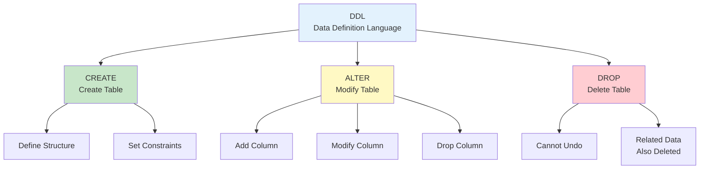

# Chapter 2: Database and Table Design

---

## 📋 Course Overview

**Course Topic**: Table Design Using DDL (CREATE, ALTER, DROP) | DDL(CREATE, ALTER, DROP)을 이용한 테이블 설계

**Course Objectives**

- Master CREATE TABLE syntax completely | CREATE TABLE 문법 완벽 숙달
- Understand data types and constraints | 데이터타입 및 제약조건 이해
- Modify tables with ALTER TABLE | ALTER TABLE로 테이블 수정
- Design databases efficiently | 효율적인 데이터베이스 설계

---

## 📚 Part 1: Theoretical Learning

### What You'll Learn in This Section

In this section, you will learn the core concepts of data types and constraints for database design. You will understand when each data type is used and how constraints ensure data integrity. You will also learn DDL commands such as CREATE TABLE and ALTER TABLE to design and modify tables in practice.

| 이 섹션에서는 데이터베이스 설계의 핵심인 데이터타입과 제약조건의 개념을 학습합니다. 각 데이터타입이 언제 사용되는지, 그리고 제약조건이 데이터 무결성을 어떻게 보장하는지를 이해합니다. 또한 CREATE TABLE, ALTER TABLE 등의 DDL 명령어를 익혀 실제로 테이블을 설계하고 수정하는 방법을 배웁니다.



### 2-1. Understanding Data Types

#### **Major Data Types**

```
Numeric:
├─ INT: Integer (-2,147,483,648 ~ 2,147,483,647)
├─ DECIMAL(5,2): Fixed-point (3digits.2decimals, suitable for currency)
├─ FLOAT, DOUBLE: Floating-point (for performance)
└─ BIGINT: Large integer

Character:
├─ VARCHAR(n): Variable-length string (0~255 characters, recommended)
├─ CHAR(n): Fixed-length string (may waste space)
├─ TEXT: Long text
└─ ENUM: Predefined values only (Male/Female)

Date/Time:
├─ DATE: 2024-01-15
├─ TIME: 14:30:45
├─ DATETIME: 2024-01-15 14:30:45
└─ TIMESTAMP: Automatically recorded

Other:
├─ BOOLEAN: TRUE/FALSE
└─ BLOB: Binary data (images, files)
```

### 2-2. Constraints

```
PRIMARY KEY
├─ Uniquely identifies each row
├─ No duplicates, no NULL
└─ Set in CREATE TABLE

NOT NULL
├─ Must have a value
└─ Example: name, student ID

UNIQUE
├─ No duplicates (NULL allowed)
└─ Example: email, national ID

DEFAULT
├─ Use default value if not entered
└─ Example: registration date = CURDATE()

CHECK
├─ Only accept values meeting conditions
└─ Example: age >= 0

FOREIGN KEY
├─ References primary key of another table
└─ Maintain referential integrity
```

### 2-3. CREATE TABLE Syntax

```sql
CREATE TABLE table_name (
    column_name1 data_type [constraint],
    column_name2 data_type [constraint],
    PRIMARY KEY (column_name)
) CHARACTER SET utf8mb4;

Real Example:
CREATE TABLE employee (
    emp_id INT PRIMARY KEY AUTO_INCREMENT,
    emp_name VARCHAR(30) NOT NULL,
    department VARCHAR(20),
    salary DECIMAL(10,2),
    hire_date DATE DEFAULT CURDATE(),
    CHECK (salary > 0)
) CHARACTER SET utf8mb4;
```

### 2-4. ALTER TABLE Syntax

```sql
-- Add column
ALTER TABLE table_name 
ADD column_name data_type;

-- Delete column
ALTER TABLE table_name 
DROP COLUMN column_name;

-- Modify column
ALTER TABLE table_name 
MODIFY column_name new_data_type;

-- Rename column
ALTER TABLE table_name 
CHANGE old_name new_name data_type;
```

---

## 📚 Part 2: Sample Table Design

### What You'll Learn in This Section

In this section, you will apply the data types and constraints you have learned to actually design tables. Through examples of department and employee tables, you will learn how to set relationships between tables and define foreign keys. You will also insert sample data to verify that your designed table works properly.

| 이 섹션에서는 배운 데이터타입과 제약조건을 실제로 적용하여 테이블을 설계합니다. department 테이블과 employee 테이블의 예시를 통해 테이블 간 관계를 설정하고, 외래키를 정의하는 방법을 배웁니다. 또한 샘플 데이터를 삽입하여 설계한 테이블이 제대로 작동하는지 확인합니다.

### 2-1. Create Database and Tables

```sql
-- Create database
CREATE DATABASE ch2_design CHARACTER SET utf8mb4;
USE ch2_design;

-- Department table
CREATE TABLE department (
    dept_id INT PRIMARY KEY AUTO_INCREMENT,
    dept_name VARCHAR(30) NOT NULL UNIQUE,
    location VARCHAR(30),
    budget DECIMAL(15,2),
    CONSTRAINT check_budget CHECK (budget >= 0)
) CHARACTER SET utf8mb4;

-- Employee table
CREATE TABLE employee (
    emp_id INT PRIMARY KEY AUTO_INCREMENT,
    emp_name VARCHAR(30) NOT NULL,
    dept_id INT,
    position VARCHAR(20),
    salary DECIMAL(10,2),
    hire_date DATE DEFAULT CURDATE(),
    phone VARCHAR(15),
    FOREIGN KEY (dept_id) REFERENCES department(dept_id),
    CONSTRAINT check_salary CHECK (salary > 0)
) CHARACTER SET utf8mb4;

-- Sample data
INSERT INTO department VALUES
(1, 'Sales Team', 'Seoul', 100000000),
(2, 'Development Team', 'Pangyo', 150000000),
(3, 'HR Team', 'Seoul', 50000000);

INSERT INTO employee VALUES
(1, 'Kim Chulsu', 1, 'Team Lead', 5000000, '2020-01-15', '010-1111-1111'),
(2, 'Lee Younghee', 2, 'Developer', 4000000, '2021-03-20', '010-2222-2222'),
(3, 'Park Boyoung', 2, 'Developer', 3500000, '2022-06-10', '010-3333-3333');
```

---

## 💻 Part 3: Practice

### What You'll Learn in This Section

In this section, you will execute the DDL commands you have learned to create and modify tables. You will apply various data types and constraints using CREATE TABLE, and practice changing table structure with ALTER TABLE. Through this, you will develop actual database design skills.

| 이 섹션에서는 배운 DDL 명령어를 직접 실행하여 테이블을 만들고 수정해봅니다. CREATE TABLE을 사용하여 다양한 데이터타입과 제약조건을 적용하고, ALTER TABLE로 테이블 구조를 변경하는 실습을 하게 됩니다. 이를 통해 실제 데이터베이스 설계 능력을 기르게 됩니다.

### 3-1. Basic Table Creation Practice

**Practice 2-1: Create Simple Table**

```sql
-- Customer table
CREATE TABLE customer (
    customer_id INT PRIMARY KEY AUTO_INCREMENT,
    customer_name VARCHAR(30) NOT NULL,
    email VARCHAR(50) UNIQUE,
    phone VARCHAR(15),
    signup_date DATE DEFAULT CURDATE()
) CHARACTER SET utf8mb4;

-- Verification
DESC customer;
SHOW CREATE TABLE customer;
```

**Practice 2-2: Table with Constraints**

```sql
-- Product table
CREATE TABLE product (
    product_id INT PRIMARY KEY AUTO_INCREMENT,
    product_name VARCHAR(50) NOT NULL,
    category VARCHAR(20),
    price INT,
    stock INT DEFAULT 0,
    CHECK (price > 0),
    CHECK (stock >= 0)
) CHARACTER SET utf8mb4;

-- Insert data
INSERT INTO product VALUES
(NULL, 'Laptop', 'Electronics', 1500000, 10),
(NULL, 'Mouse', 'Electronics', 50000, 50),
(NULL, 'Desk', 'Furniture', 300000, 5);
```

---

### 3-2. Table Modification Practice

**Practice 2-3: ALTER TABLE Exercises**

```sql
-- Add columns to customer table
ALTER TABLE customer 
ADD address VARCHAR(100);

ALTER TABLE customer 
ADD grade VARCHAR(10) DEFAULT 'Silver';

-- Verification
DESC customer;

-- Modify column
ALTER TABLE customer 
MODIFY phone VARCHAR(20);

-- Delete column
ALTER TABLE customer 
DROP COLUMN grade;
```

---

### 3-3. Comprehensive Design Practice

**Practice 2-4: Complete Database Design**

```sql
-- Order system design

CREATE TABLE orders (
    order_id INT PRIMARY KEY AUTO_INCREMENT,
    customer_id INT NOT NULL,
    order_date DATETIME DEFAULT CURRENT_TIMESTAMP,
    total_amount DECIMAL(12,2),
    status VARCHAR(20) DEFAULT 'Order Received',
    FOREIGN KEY (customer_id) REFERENCES customer(customer_id),
    CHECK (total_amount > 0)
) CHARACTER SET utf8mb4;

CREATE TABLE order_detail (
    order_detail_id INT PRIMARY KEY AUTO_INCREMENT,
    order_id INT NOT NULL,
    product_id INT NOT NULL,
    quantity INT NOT NULL,
    price DECIMAL(10,2),
    FOREIGN KEY (order_id) REFERENCES orders(order_id),
    FOREIGN KEY (product_id) REFERENCES product(product_id),
    CHECK (quantity > 0)
) CHARACTER SET utf8mb4;

-- Check table structure
SHOW TABLES;
DESC orders;
DESC order_detail;
```

---

## 📝 Part 4: Assignment Instructions

### Theoretical Assignments

**Assignment 1**: Explain the differences between VARCHAR(30) and CHAR(30) data types and provide two examples each where they are appropriately used. Also discuss from the perspective of storage space efficiency. | VARCHAR(30)과 CHAR(30) 데이터타입의 차이점을 설명하고, 각각이 적절하게 사용되는 사례를 두 가지씩 제시하세요. 저장 공간 효율성 관점에서도 논의하세요.

**Assignment 2**: Explain whether to choose DECIMAL(10,2) or FLOAT data type when storing amounts and compare the advantages and disadvantages of each data type. | 금액을 저장할 때 DECIMAL(10,2)과 FLOAT 데이터타입 중 어느 것을 선택해야 하는지 설명하고, 각 데이터타입의 장단점을 비교 분석하세요.

**Assignment 3**: Explain the differences between PRIMARY KEY and UNIQUE constraints and describe how these two constraints should be distinguished when designing tables with real-world examples. | PRIMARY KEY와 UNIQUE 제약조건의 차이를 설명하고, 테이블 설계 시 이 두 제약조건을 어떻게 구분하여 적용해야 하는지 실무 사례를 들어 서술하세요.

**Assignment 4**: Explain the differences between applying NOT NULL and UNIQUE constraints together versus separately and discuss their impact on data integrity. | NOT NULL 제약조건과 UNIQUE 제약조건을 함께 적용했을 때와 따로 적용했을 때의 차이점을 설명하고, 각각이 데이터 무결성에 미치는 영향을 논의하세요.

**Assignment 5**: Explain the role and importance of foreign keys and explain with examples the data consistency problems that can occur when foreign keys are not used. | 외래키(FOREIGN KEY)의 역할과 중요성을 설명하고, 외래키를 사용하지 않았을 때 발생 가능한 데이터 일관성 문제를 사례를 들어 설명하세요.

Submission Format: Word or PDF document (1-2 pages)

---

### Practical Assignments

**Assignment 1**: Design a professor table that satisfies the following requirements and write a CREATE TABLE statement. The table should consist of: professor ID (integer, primary key, auto-increment), professor name (variable character 30, required), department (variable character 20), position (variable character 20), and salary (decimal 10 digits 2 decimals, only 0 or higher allowed). | 다음의 요구사항을 만족하는 professor 테이블을 설계하여 CREATE TABLE 문을 작성하세요. 테이블은 교수번호(정수형, 기본키, 자동증가), 교수명(가변 문자형 30자, 필수), 학과(가변 문자형 20자), 직급(가변 문자형 20자), 급여(십진수 10자리 2소수자리, 0 이상만 허용)로 구성되어야 합니다.

**Assignment 2**: Insert 5 or more professor data with realistic information into the professor table. Each professor should have diverse departments and positions like those at a real university. | professor 테이블에 5명 이상의 교수 데이터를 현실적인 정보로 입력하세요. 각 교수는 실제 대학교의 교수처럼 다양한 학과와 직급을 가져야 합니다.

**Assignment 3**: Use ALTER TABLE statement to add a new column called phone to the professor table. This column should be variable character type for storing professor phone numbers. After adding, confirm the table structure with DESC command and attach a screenshot of the changes. | ALTER TABLE 문을 사용하여 professor 테이블에 phone이라는 새로운 열을 추가하세요. 이 열은 교수의 휴대폰 번호를 저장하기 위한 가변 문자형이어야 합니다. 추가 후 DESC 명령어로 테이블 구조를 확인해 변경사항을 스크린샷으로 첨부하세요.

**Assignment 4**: Modify the salary column of the professor table to DECIMAL(12,2) to be able to store larger amounts. Use the MODIFY command of ALTER TABLE to modify, then verify that the modification was properly applied with DESCRIBE or SHOW CREATE TABLE and submit the result as a screenshot. | professor 테이블의 salary 열을 DECIMAL(12,2)로 수정하여 더 큰 금액을 저장할 수 있도록 변경하세요. ALTER TABLE의 MODIFY 명령어를 사용하여 수정한 후 수정이 제대로 적용되었는지 DESCRIBE 또는 SHOW CREATE TABLE로 확인하고 결과를 스크린샷으로 제출하세요.

**Assignment 5**: Check the entire structure of the professor table you have created using DESC command to verify that all design requirements are accurately reflected. Attach the final table structure as a screenshot and briefly explain why each column's data type and constraints were designed that way. | 지금까지 생성한 professor 테이블의 전체 구조를 DESC 명령어로 조회하여 모든 설계 요구사항이 정확하게 반영되었는지 확인하세요. 최종적인 테이블 구조를 스크린샷으로 첨부하고, 각 열의 데이터타입과 제약조건이 왜 그렇게 설계되었는지 간단히 설명하세요.

Submission Format: SQL file (Ch2_Table_Design_[StudentID].sql)

---

Thank you for your hard work.

Prof. Cho Jeong-Hyun (peterchokr@gmail.com). Yeungnam University College
