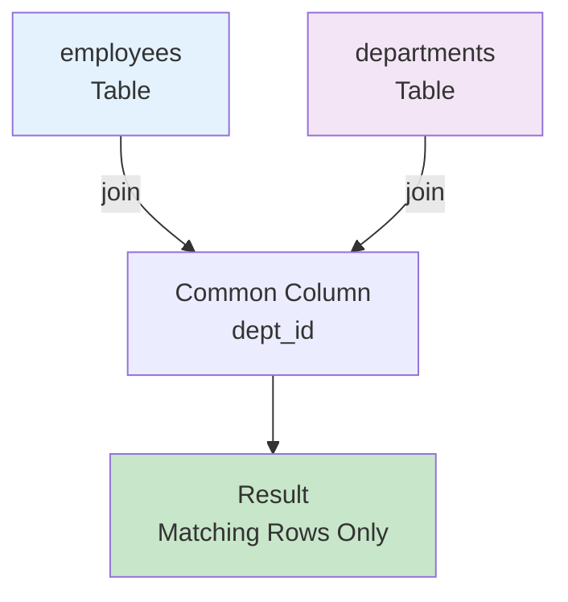
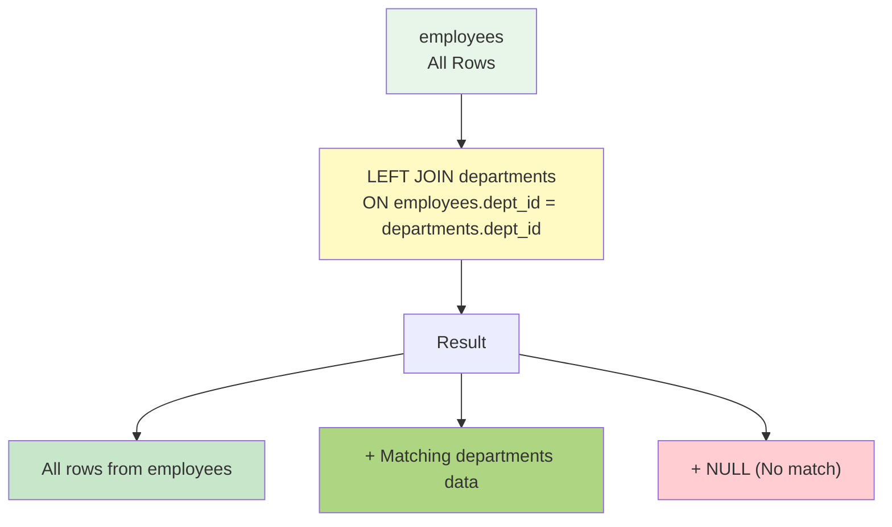

# Chapter 5: JOIN Operations - Basic

---

## 📋 Course Overview

**Course Topic**: Multi-Table Query Using INNER JOIN and LEFT JOIN | INNER JOIN과 LEFT JOIN을 이용한 다중 테이블 조회

**Course Objectives**

- Understand the concept and necessity of JOIN | JOIN의 개념과 필요성 이해
- Master INNER JOIN perfectly | INNER JOIN 완벽 숙달
- Understand LEFT JOIN (LEFT OUTER JOIN) | LEFT JOIN (LEFT OUTER JOIN) 이해
- Distinguish between ON clause and WHERE clause | ON 절과 WHERE 절의 차이 구분

---

## 📚 Part 1: Theoretical Learning

### What You'll Learn in This Section

In this section, you will learn the concept of JOIN to query data that has been separated into multiple tables due to database normalization. You will learn how to query data that exists in both tables using INNER JOIN, and how to connect data from another table while including all data from one table using LEFT JOIN. Through this, you will develop the ability to query multiple tables. 

| 이 섹션에서는 데이터베이스 정규화로 인해 여러 테이블로 분리된 데이터를 조회하기 위한 JOIN의 개념을 배웁니다. INNER JOIN으로 양쪽 테이블에 모두 존재하는 데이터를 조회하고, LEFT JOIN으로 한쪽 테이블의 모든 데이터를 포함하면서 다른 테이블의 데이터를 연결하는 방법을 학습합니다. 이를 통해 다중 테이블 조회 능력을 기르게 됩니다.

### 1-1. Why JOIN is Needed

Database normalization requires JOIN to query data separated into multiple tables. For example, when student information, enrollment information, and course information are stored in different tables, you need to connect these tables to query the courses a student took. 

| 데이터베이스 정규화는 여러 테이블로 분리된 데이터를 조회하기 위해 JOIN을 요구합니다. 예를 들어, 학생 정보, 수강 정보, 강좌 정보가 각각 다른 테이블에 저장되어 있을 때, 학생이 수강한 강좌를 조회하려면 이 테이블들을 연결해야 합니다.

### 1-2. INNER JOIN

INNER JOIN queries only data that exists in both tables. The basic syntax is SELECT * FROM table1 INNER JOIN table2 ON condition;. This returns only the common parts of the two tables as results. 

| INNER JOIN은 양쪽 테이블 모두에 존재하는 데이터만 조회합니다. 기본 문법은 SELECT * FROM table1 INNER JOIN table2 ON condition;입니다. 이는 두 테이블의 공통 부분만 결과로 반환합니다.



### 1-3. LEFT JOIN (LEFT OUTER JOIN)

LEFT JOIN queries all data from the left table and matching data from the right table. All rows from the left table are included, and if there is no matching data in the right table, NULL is displayed. 

| LEFT JOIN은 왼쪽 테이블의 모든 데이터와 오른쪽 테이블의 일치하는 데이터를 조회합니다. 왼쪽 테이블의 모든 행이 포함되며, 오른쪽 테이블에 일치하는 데이터가 없으면 NULL이 표시됩니다.



### 1-4. ON Clause vs WHERE Clause

The ON clause specifies the condition for JOIN and defines how to connect the two tables. The WHERE clause applies additional filtering to the JOIN result to include only desired rows in the final result. 

| ON 절은 JOIN의 조건을 지정하며, 두 테이블을 어떻게 연결할 것인지 정의합니다. WHERE 절은 JOIN 결과에 추가 필터를 적용하여 원하는 행만 최종 결과에 포함시킵니다.

---

## 📚 Part 2: Sample Data

### What You'll Learn in This Section

In this section, you will create four tables (professor, course, student, enrollment) for JOIN practice and set up relationships. You will define relationships between tables through foreign keys of each table and insert sample data modeling an actual academic management system. 

| 이 섹션에서는 JOIN 실습에 사용할 네 개의 테이블(professor, course, student, enrollment)을 생성하고 관계를 설정합니다. 각 테이블의 외래키를 통해 테이블 간 관계를 정의하고, 실제 학사관리 시스템을 모델링한 샘플 데이터를 삽입합니다.

```sql
CREATE DATABASE ch5_join CHARACTER SET utf8mb4;
USE ch5_join;

CREATE TABLE professor (
    professor_id INT PRIMARY KEY AUTO_INCREMENT,
    professor_name VARCHAR(30) NOT NULL,
    department VARCHAR(30)
) CHARACTER SET utf8mb4;

CREATE TABLE course (
    course_id INT PRIMARY KEY AUTO_INCREMENT,
    course_name VARCHAR(30) NOT NULL,
    credits INT,
    professor_id INT,
    FOREIGN KEY (professor_id) REFERENCES professor(professor_id)
) CHARACTER SET utf8mb4;

CREATE TABLE student (
    student_id INT PRIMARY KEY AUTO_INCREMENT,
    student_name VARCHAR(30) NOT NULL,
    major VARCHAR(30)
) CHARACTER SET utf8mb4;

CREATE TABLE enrollment (
    enrollment_id INT PRIMARY KEY AUTO_INCREMENT,
    student_id INT,
    course_id INT,
    grade VARCHAR(2),
    FOREIGN KEY (student_id) REFERENCES student(student_id),
    FOREIGN KEY (course_id) REFERENCES course(course_id)
) CHARACTER SET utf8mb4;

INSERT INTO professor VALUES
(1, 'Park Chulsu', 'AI Software Department'),
(2, 'Lee Younghee', 'AI Software Department'),
(3, 'Choi Junho', 'AI Software Department');

INSERT INTO course VALUES
(1, 'Database', 3, 1),
(2, 'Web Programming', 3, 2),
(3, 'Artificial Intelligence', 3, 1),
(4, 'Cloud Computing', 3, 3);

INSERT INTO student VALUES
(1, 'Student A', 'AI Software Department'),
(2, 'Student B', 'AI Software Department'),
(3, 'Student C', 'Computer Science'),
(4, 'Student D', 'AI Software Department');

INSERT INTO enrollment VALUES
(1, 1, 1, 'A'),
(2, 1, 2, 'B'),
(3, 2, 1, 'A'),
(4, 2, 3, 'B'),
(5, 3, 2, 'C'),
(6, 4, 1, 'A');
```

---

## 💻 Part 3: Practice

### What You'll Learn in This Section

In this section, you will execute the learned JOINs to write various queries. Starting with practice using INNER JOIN to connect related data, you will move on to practice using LEFT JOIN to include all data from one table. You will also write complex queries that JOIN 3 or more tables and filter results with WHERE clause, developing JOIN skills needed in practice.

| 이 섹션에서는 배운 JOIN을 실제로 실행하여 다양한 쿼리를 작성합니다. INNER JOIN으로 관련 데이터를 연결하는 실습부터 시작하여, LEFT JOIN으로 한쪽 테이블의 모든 데이터를 포함하는 실습을 하게 됩니다. 또한 3개 이상의 테이블을 JOIN하고 WHERE 절로 결과를 필터링하는 복잡한 쿼리도 작성하게 되어, 실무에서 필요한 JOIN 능력을 기르게 됩니다.

### 3-1. INNER JOIN Practice

**Practice 5-1~5-15: Basic INNER JOIN**

```sql
1. Query course and responsible professor
SELECT c.course_name, p.professor_name
FROM course c
INNER JOIN professor p ON c.professor_id = p.professor_id;

2. Query course name, professor name, credits together
SELECT c.course_name, p.professor_name, c.credits
FROM course c
INNER JOIN professor p ON c.professor_id = p.professor_id;

3. Query student and enrolled course
SELECT s.student_name, c.course_name
FROM student s
INNER JOIN enrollment e ON s.student_id = e.student_id
INNER JOIN course c ON e.course_id = c.course_id;

4. Query student, course, grade
SELECT s.student_name, c.course_name, e.grade
FROM student s
INNER JOIN enrollment e ON s.student_id = e.student_id
INNER JOIN course c ON e.course_id = c.course_id;

5. Query course and number of students taking it
SELECT c.course_name, COUNT(e.student_id) AS enrollment_count
FROM course c
INNER JOIN enrollment e ON c.course_id = e.course_id
GROUP BY c.course_name;

6. Query courses by professor
SELECT p.professor_name, c.course_name
FROM professor p
INNER JOIN course c ON p.professor_id = c.professor_id;

7. Query enrollment with grade A
SELECT s.student_name, c.course_name, e.grade
FROM student s
INNER JOIN enrollment e ON s.student_id = e.student_id
INNER JOIN course c ON e.course_id = c.course_id
WHERE e.grade = 'A';

8. Query courses taken by AI Software Department students
SELECT s.student_name, c.course_name
FROM student s
INNER JOIN enrollment e ON s.student_id = e.student_id
INNER JOIN course c ON e.course_id = c.course_id
WHERE s.major = 'AI Software Department';

9. Query students taking Database course
SELECT s.student_name, e.grade
FROM student s
INNER JOIN enrollment e ON s.student_id = e.student_id
INNER JOIN course c ON e.course_id = c.course_id
WHERE c.course_name = 'Database';

10. Query number of courses taken by student
SELECT s.student_name, COUNT(e.course_id) AS course_count
FROM student s
INNER JOIN enrollment e ON s.student_id = e.student_id
GROUP BY s.student_name;

11. Query students taking Park Chulsu professors course
SELECT DISTINCT s.student_name
FROM student s
INNER JOIN enrollment e ON s.student_id = e.student_id
INNER JOIN course c ON e.course_id = c.course_id
INNER JOIN professor p ON c.professor_id = p.professor_id
WHERE p.professor_name = 'Park Chulsu';

12. Query average grade by course
SELECT c.course_name, AVG(CASE WHEN e.grade = 'A' THEN 4.0 
                               WHEN e.grade = 'B' THEN 3.0 
                               WHEN e.grade = 'C' THEN 2.0 END) AS average
FROM course c
INNER JOIN enrollment e ON c.course_id = e.course_id
GROUP BY c.course_name;

13. Query students taking 3-credit courses
SELECT DISTINCT s.student_name, c.course_name
FROM student s
INNER JOIN enrollment e ON s.student_id = e.student_id
INNER JOIN course c ON e.course_id = c.course_id
WHERE c.credits = 3;

14. Query enrollment information sorted by student name
SELECT s.student_name, c.course_name, e.grade
FROM student s
INNER JOIN enrollment e ON s.student_id = e.student_id
INNER JOIN course c ON e.course_id = c.course_id
ORDER BY s.student_name;

15. Query student list by course
SELECT c.course_name, s.student_name, e.grade
FROM course c
INNER JOIN enrollment e ON c.course_id = e.course_id
INNER JOIN student s ON e.student_id = s.student_id
ORDER BY c.course_name;
```

---

### 3-2. LEFT JOIN Practice

**Practice 5-16~5-25: LEFT JOIN**

```sql
16. Query all professors and courses (including professors without courses)
SELECT p.professor_name, c.course_name
FROM professor p
LEFT JOIN course c ON p.professor_id = c.professor_id;

17. Query all students and enrolled courses (including students without courses)
SELECT s.student_name, c.course_name
FROM student s
LEFT JOIN enrollment e ON s.student_id = e.student_id
LEFT JOIN course c ON e.course_id = c.course_id;

18. Query all courses and number of students (including courses without students)
SELECT c.course_name, COUNT(e.student_id) AS enrollment_count
FROM course c
LEFT JOIN enrollment e ON c.course_id = e.course_id
GROUP BY c.course_name;

19. Query course, responsible professor, students
SELECT c.course_name, p.professor_name, s.student_name
FROM course c
LEFT JOIN professor p ON c.professor_id = p.professor_id
LEFT JOIN enrollment e ON c.course_id = e.course_id
LEFT JOIN student s ON e.student_id = s.student_id;

20. Query all students and their grades
SELECT s.student_name, 
       CASE WHEN e.grade = 'A' THEN 'Excellent'
            WHEN e.grade = 'B' THEN 'Good'
            WHEN e.grade = 'C' THEN 'Average'
            ELSE 'Not Enrolled' END AS evaluation
FROM student s
LEFT JOIN enrollment e ON s.student_id = e.student_id;

21. Query professors without assigned courses
SELECT p.professor_name
FROM professor p
LEFT JOIN course c ON p.professor_id = c.professor_id
WHERE c.course_id IS NULL;

22. Query students without enrolled courses
SELECT s.student_name
FROM student s
LEFT JOIN enrollment e ON s.student_id = e.student_id
WHERE e.enrollment_id IS NULL;

23. Query courses without students
SELECT c.course_name
FROM course c
LEFT JOIN enrollment e ON c.course_id = e.course_id
WHERE e.enrollment_id IS NULL;

24. Query number of courses by professor
SELECT p.professor_name, COUNT(c.course_id) AS course_count
FROM professor p
LEFT JOIN course c ON p.professor_id = c.professor_id
GROUP BY p.professor_name;

25. Query enrollment status for all students
SELECT s.student_name, 
       CASE WHEN COUNT(e.student_id) = 0 THEN 'Not Enrolled'
            ELSE CONCAT(COUNT(e.student_id), ' courses') END AS enrollment_status
FROM student s
LEFT JOIN enrollment e ON s.student_id = e.student_id
GROUP BY s.student_name;
```

---

### 3-3. Complex JOIN and Advanced Practice

**Practice 5-26~5-40: Complex JOIN and Filtering**

```sql
26. Query number of students by grade
SELECT e.grade, COUNT(e.student_id) AS student_count
FROM enrollment e
GROUP BY e.grade;

27. Query enrollment course status by major
SELECT s.major, COUNT(DISTINCT e.course_id) AS course_count
FROM student s
LEFT JOIN enrollment e ON s.student_id = e.student_id
GROUP BY s.major;

28. Query students taking 2 or more courses
SELECT s.student_name, COUNT(e.course_id) AS course_count
FROM student s
INNER JOIN enrollment e ON s.student_id = e.student_id
GROUP BY s.student_name
HAVING COUNT(e.course_id) >= 2;

29. Query students with B grade or higher
SELECT DISTINCT s.student_name
FROM student s
INNER JOIN enrollment e ON s.student_id = e.student_id
WHERE e.grade IN ('A', 'B');

30. Query courses taken by same major students
SELECT s1.student_name, s2.student_name, c.course_name
FROM student s1
JOIN enrollment e1 ON s1.student_id = e1.student_id
JOIN course c ON e1.course_id = c.course_id
JOIN enrollment e2 ON c.course_id = e2.course_id
JOIN student s2 ON e2.student_id = s2.student_id
WHERE s1.major = s2.major AND s1.student_id < s2.student_id;

31. Query total enrollment by professor
SELECT p.professor_name, COUNT(DISTINCT e.student_id) AS student_count
FROM professor p
LEFT JOIN course c ON p.professor_id = c.professor_id
LEFT JOIN enrollment e ON c.course_id = e.course_id
GROUP BY p.professor_name;

32. Query grade distribution by course
SELECT c.course_name, e.grade, COUNT(*) AS count
FROM course c
LEFT JOIN enrollment e ON c.course_id = e.course_id
GROUP BY c.course_name, e.grade
ORDER BY c.course_name;

33. Query total credits by student
SELECT s.student_name, COALESCE(SUM(c.credits), 0) AS total_credits
FROM student s
LEFT JOIN enrollment e ON s.student_id = e.student_id
LEFT JOIN course c ON e.course_id = c.course_id
GROUP BY s.student_name;

34. Query enrollment by course in AI Software Department
SELECT c.course_name, COUNT(DISTINCT e.student_id) AS major_enrollment
FROM course c
LEFT JOIN enrollment e ON c.course_id = e.course_id
LEFT JOIN student s ON e.student_id = s.student_id
WHERE s.major = 'AI Software Department' OR s.major IS NULL
GROUP BY c.course_name;

35. Query students taking latest courses (by course ID)
SELECT s.student_name, c.course_name
FROM student s
INNER JOIN enrollment e ON s.student_id = e.student_id
INNER JOIN course c ON e.course_id = c.course_id
WHERE c.course_id >= 3
ORDER BY c.course_id DESC;

36. Query courses opened by professor
SELECT p.professor_name, 
       GROUP_CONCAT(c.course_name SEPARATOR ', ') AS opened_courses
FROM professor p
LEFT JOIN course c ON p.professor_id = c.professor_id
GROUP BY p.professor_name;

37. Query courses with A grade students
SELECT DISTINCT c.course_name
FROM course c
INNER JOIN enrollment e ON c.course_id = e.course_id
WHERE e.grade = 'A';

38. Query courses without professor
SELECT c.course_name
FROM course c
LEFT JOIN professor p ON c.professor_id = p.professor_id
WHERE p.professor_id IS NULL;

39. Query enrollment by major and course
SELECT s.major, c.course_name, COUNT(e.student_id) AS enrollment
FROM student s
INNER JOIN enrollment e ON s.student_id = e.student_id
INNER JOIN course c ON e.course_id = c.course_id
GROUP BY s.major, c.course_name
ORDER BY s.major, COUNT(e.student_id) DESC;

40. Query completed courses and credits by student
SELECT s.student_name, 
       GROUP_CONCAT(c.course_name SEPARATOR ', ') AS completed_courses,
       SUM(c.credits) AS total_credits
FROM student s
INNER JOIN enrollment e ON s.student_id = e.student_id
INNER JOIN course c ON e.course_id = c.course_id
GROUP BY s.student_name;
```

---

---

## 📝 Part 4: Assignment Instructions

### Theoretical Assignments

**Assignment 1**: Explain the most fundamental difference between INNER JOIN and LEFT JOIN and specifically describe the composition of the result set returned by each. | INNER JOIN과 LEFT JOIN의 가장 근본적인 차이를 설명하고, 각각이 반환하는 결과 집합의 구성을 구체적으로 서술하세요.

**Assignment 2**: Explain the role of the ON clause and describe how it differs from the WHERE clause with specific query examples. | ON 절의 역할을 설명하고, WHERE 절과 어떻게 다르게 작용하는지 구체적인 쿼리 예시를 들어 설명하세요.

**Assignment 3**: Explain whether the order of tables affects the result when JOINing multiple tables and discuss why the position of the left table is important in the case of LEFT JOIN. | 여러 테이블을 JOIN할 때 테이블의 순서가 결과에 영향을 미치는지 설명하고, LEFT JOIN의 경우 왼쪽 테이블의 위치가 중요한 이유를 논의하세요.

**Assignment 4**: Explain the impact of NULL values on the JOIN operation and present a method for predicting JOIN results when NULL exists. | NULL 값이 JOIN 연산에 미치는 영향을 설명하고, NULL이 있을 때의 JOIN 결과 예측 방법을 제시하세요.

**Assignment 5**: Explain why JOIN is essential when a database is normalized and separated into multiple tables and discuss the problems that occur when JOIN is not used. | 데이터베이스를 정규화하여 여러 테이블로 분리했을 때 JOIN이 필수적인 이유를 설명하고, JOIN을 사용하지 않았을 때의 문제점을 논의하세요.

Submission Format: Word or PDF document (1-2 pages)

---

### Practical Assignments

**Assignment 1**: Write a SQL statement to INNER JOIN professor and course tables to query course name and responsible professor name. | professor, course 테이블을 INNER JOIN하여 강좌명과 담당교수명을 조회하는 SQL 문을 작성하세요.

**Assignment 2**: Write a query that sequentially INNER JOINs student, enrollment, and course tables to display student name, enrolled course name, and grade all together. | student, enrollment, course 테이블을 순차적으로 INNER JOIN하여 학생명, 수강강좌명, 성적을 모두 표시하는 쿼리를 작성하세요.

**Assignment 3**: LEFT JOIN the professor table to query course information. Professors without assigned courses should also be included. | professor 테이블을 LEFT JOIN하여 담당강좌 정보를 조회하세요. 담당강좌가 없는 교수도 포함되어야 합니다.

**Assignment 4**: LEFT JOIN the student table to query all students and the courses they took, ensuring students without enrolled courses are also displayed. | student 테이블을 LEFT JOIN하여 모든 학생과 그들이 수강한 강좌를 조회하되, 수강 강좌가 없는 학생도 표시되도록 작성하세요.

**Assignment 5**: Execute all queries provided from Practice 5-1 to 5-40 in Part 3 and attach screenshots of each query execution result. | Part 3의 실습 5-1부터 5-40까지 제공된 모든 쿼리를 직접 실행하고, 각 쿼리의 실행 결과를 스크린샷으로 첨부하세요.

Submission Format: SQL file (Ch5_JOIN_Practice_[StudentID].sql) and screenshots

---

Thank you for your hard work.

Prof. Cho Jeong-Hyun (peterchokr@gmail.com). Yeungnam University College
